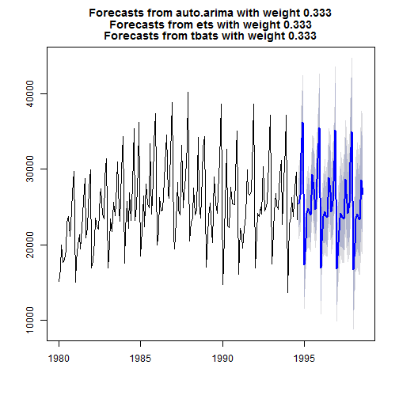
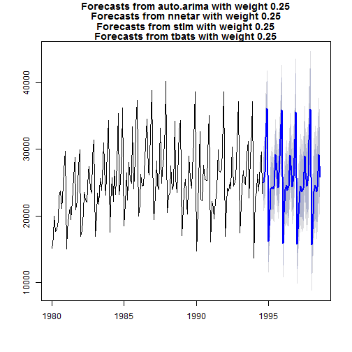

[](https://travis-ci.org/ellisp/forecastHybrid)
[](https://coveralls.io/github/ellisp/forecastHybrid?branch=master)
[](http://www.r-pkg.org/pkg/forecastHybrid)
[](http://www.r-pkg.org/pkg/forecastHybrid)

# forecastHybrid
Convenient functions for ensemble forecasts in R combining approaches from the [forecast](https://github.com/robjhyndman/forecast) package.

For a more detailed description of the package and usage, consult the [vignette](/pkg/vignettes/forecastHybrid.Rmd).

The package is still under heavy development, but many basic features have been implemented. Some features (such as optimized parallelization between rather than within models, cross validation for determing model error rates, and automatically selecting the optimal combination of base models) have not yet been developed.


## Installation
The stable release of the package is hosted on [CRAN](https://cran.r-project.org/web/packages/forecastHybrid/index.html) and can be installed as usual:
````r
install.packages("forecastHybrid")
````

The latest development version can be installed using the [devtools](https://cran.r-project.org/web/packages/devtools/index.html) package.


```r
devtools::install_github("ellisp/forecastHybrid/pkg")
```
Version updates to CRAN will be published frequently after new features are implemented, so the development version is not recommended unless you plan to modify the code.

## Usage


```r
library(forecastHybrid)

# Build a hybrid forecast on the wineind dataset using auto.arima, ets, and tbats models.
# Each model is given equal weight
hm1 <- hybridModel(wineind, models = "aet", weights = "equal")

# Now plot the forecast for the next 48 periods
plot(forecast(hm1, h = 48))
```



```r
# Build the ensemble model on the same data but this time use auto.arima, nnetar, stlm, and tbats models.
hm2 <- hybridModel(wineind, models = "anst", weights = "equal")

# Now plot the forecast for the next 48 periods
plot(forecast(hm2, h = 48))
```



```r
# Extract the point forecasts from this model
fc <- forecast(hm2, h = 48)
fc$mean
```

```
##           Jan      Feb      Mar      Apr      May      Jun      Jul
## 1994                                                               
## 1995 16349.33 20601.03 24108.68 24522.20 24193.04 24294.86 29400.42
## 1996 16442.91 20872.89 24162.15 25466.90 24265.64 24776.05 29855.33
## 1997 16263.38 20714.36 23762.96 25091.35 24121.42 24472.40 29730.75
## 1998 15974.87 20744.47 23892.48 25382.29 24126.28 24723.62 29777.50
##           Aug      Sep      Oct      Nov      Dec
## 1994          25475.55 26320.25 32082.95 36051.44
## 1995 27107.22 25160.78 26544.60 32094.86 37132.48
## 1996 26412.82 25310.13 26303.92 32540.15 36969.13
## 1997 26965.06 25103.03 26592.32 32479.43 37165.79
## 1998 26348.92
```

```r
# Extract the (default) upper 80% and 95% prediction intervals
fc$upper
```

```
##            80%      95%
##  [1,] 28444.48 30243.21
##  [2,] 30475.49 32052.98
##  [3,] 37177.01 39527.19
##  [4,] 40369.80 41955.43
##  [5,] 20563.58 21865.30
##  [6,] 24420.61 26024.45
##  [7,] 27785.42 29543.28
##  [8,] 28878.89 30503.16
##  [9,] 27950.51 29719.39
## [10,] 28331.57 29976.48
## [11,] 33014.25 35104.35
## [12,] 30691.15 32634.73
## [13,] 28333.56 30131.85
## [14,] 30773.89 32595.66
## [15,] 36955.46 39302.75
## [16,] 40866.07 42714.60
## [17,] 20476.18 21778.87
## [18,] 24971.92 26851.88
## [19,] 27703.42 29465.65
## [20,] 29457.39 31369.24
## [21,] 27895.55 29720.15
## [22,] 28931.70 30875.09
## [23,] 33512.87 35471.87
## [24,] 30662.60 32617.33
## [25,] 28869.58 30993.51
## [26,] 31403.97 33539.96
## [27,] 36946.72 39310.80
## [28,] 41516.39 43689.85
## [29,] 20477.34 22460.26
## [30,] 25642.77 27858.52
## [31,] 28167.67 30404.75
## [32,] 30148.37 32406.66
## [33,] 28493.33 30772.68
## [34,] 29642.31 31942.56
## [35,] 34233.13 36554.08
## [36,] 30870.66 33212.13
## [37,] 29596.42 32085.79
## [38,] 32139.67 34645.79
## [39,] 36973.47 39366.93
## [40,] 42271.07 44824.70
## [41,] 21029.97 23609.61
## [42,] 26416.32 29022.24
## [43,] 28950.51 31582.68
## [44,] 30940.39 33598.63
## [45,] 29294.43 31978.54
## [46,] 30452.40 33162.14
## [47,] 35052.10 37787.25
## [48,] 31698.41 34458.73
```

```r
# Extract the (default) lower 80% and 95% prediction intervals
fc$lower
```

```
##            80%       95%
##  [1,] 22270.74 20694.346
##  [2,] 22632.39 21285.419
##  [3,] 29054.19 27474.680
##  [4,] 31041.85 29195.101
##  [5,] 13051.76 11457.589
##  [6,] 18096.21 16757.327
##  [7,] 20822.76 19208.789
##  [8,] 21494.53 20214.427
##  [9,] 21027.19 19392.591
## [10,] 20852.88 19610.417
## [11,] 26178.87 24619.333
## [12,] 23228.55 21563.174
## [13,] 21393.44 19579.060
## [14,] 22449.75 21107.724
## [15,] 28524.20 26690.219
## [16,] 30852.37 29008.892
## [17,] 12562.57 10698.506
## [18,] 17869.26 15989.302
## [19,] 20323.72 18427.796
## [20,] 21414.49 20132.116
## [21,] 20509.53 18581.853
## [22,] 20790.78 19544.673
## [23,] 26108.57 24152.630
## [24,] 22681.14 20706.670
## [25,] 20845.16 18721.224
## [26,] 22403.32 21054.868
## [27,] 27957.17 25803.695
## [28,] 30798.17 28945.082
## [29,] 11974.98  9780.527
## [30,] 17271.44 15055.683
## [31,] 19715.78 17478.701
## [32,] 21385.04 19358.015
## [33,] 19881.71 17602.349
## [34,] 20764.70 18651.548
## [35,] 25464.39 23143.443
## [36,] 22024.37 19682.903
## [37,] 20191.35 17701.976
## [38,] 22378.62 20165.188
## [39,] 27285.05 24756.450
## [40,] 30765.79 28900.863
## [41,] 11283.85  8704.202
## [42,] 16570.92 13964.995
## [43,] 19005.97 16373.807
## [44,] 20897.32 18239.075
## [45,] 19153.63 16469.523
## [46,] 20214.74 17504.990
## [47,] 24718.46 21983.305
## [48,] 21269.65 18509.331
```

```r
# Produce a forecast with prediction interavals at the 70%, 80%, 90%, and 95% levels
fc2 <- forecast(hm2, h = 48, level = c(70, 80, 90, 95))
```

